# GitHub repository:

https://github.com/sergii-savchenko/rkcp_arch

# Installation

To use CLI to render document, please install (depending on your system configuration, you may need to use `sudo    `):

```
npm install -g markdown-cli-renderer
npm install -g babel-runtime
```

## Rendering document

To render current version just type:

`./render.sh`

## Viewing current documents


We recommend using MS VSCode for this:

https://code.visualstudio.com/download

With installed plugins:

* Mermaid preview
* Markdown Preview Mermaid support

After installing those plugins you should see something like this:

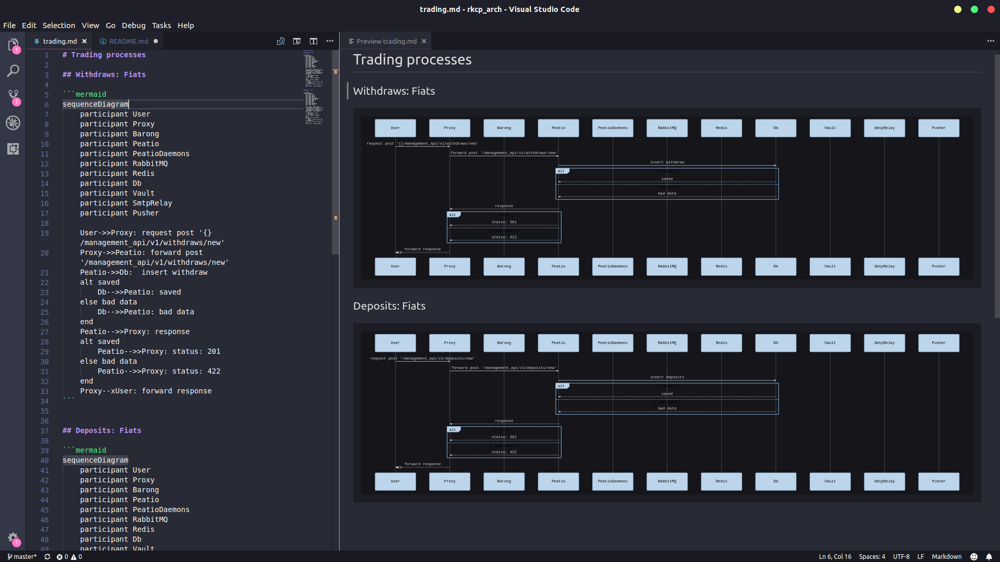


# User management API

This section contains 


# Barong Management API

This section contains diagrams on Barong Management API


## Labels with 'private' scope

### Create a label with 'private' scope and assigns to account

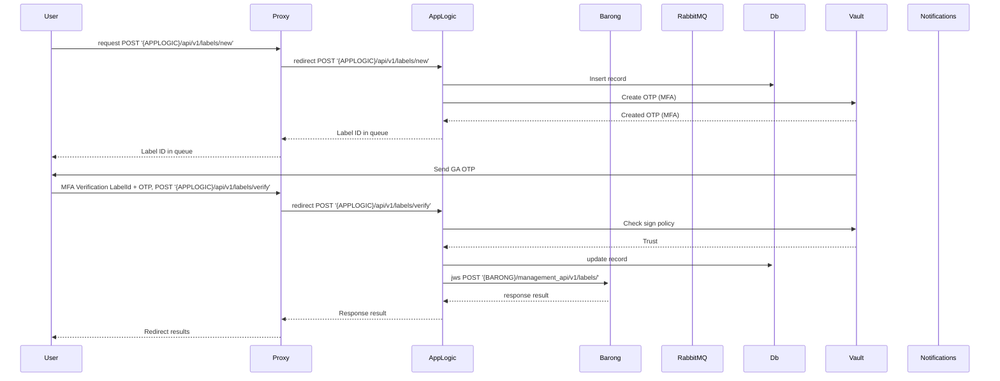

### Update label

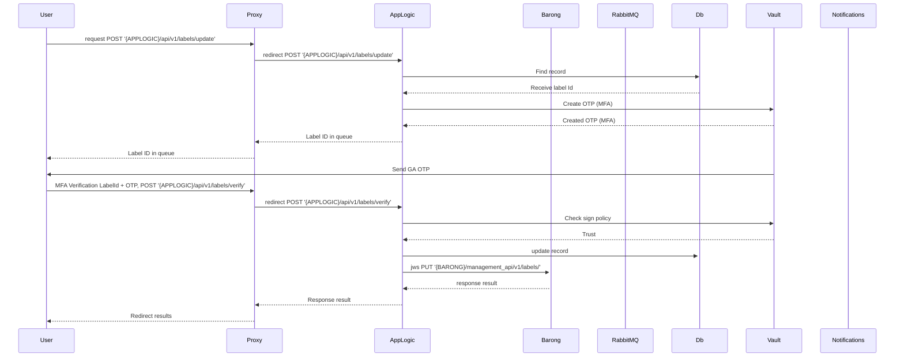

### Delete label

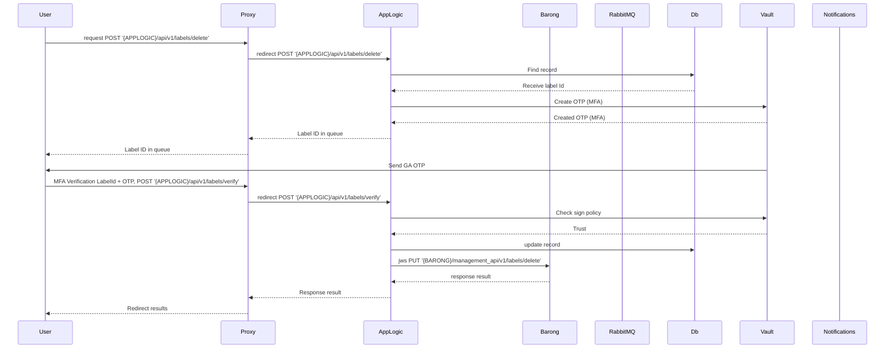
## Timestamp

### Receive server time in seconds since Unix epoch

This endpoint is useful for expiration syncronization and testing Management API

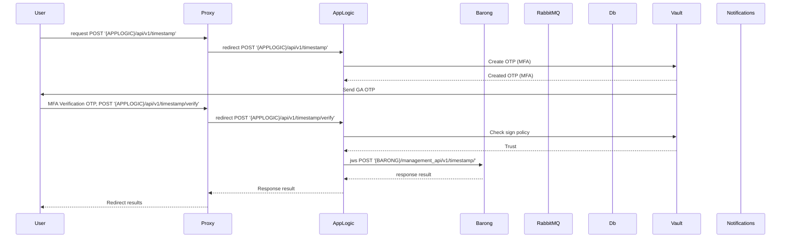
# Trading API 

This section contains trading process (Peatio member_api) - creating/canceling orders...
## Orders

### Create new order

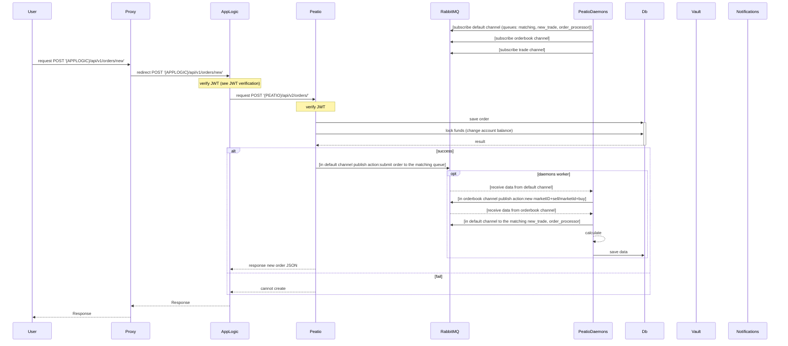

### Delete order

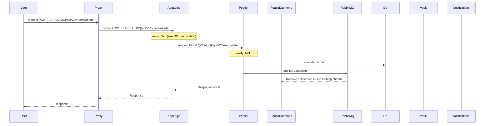
## Public data

### Get markets list

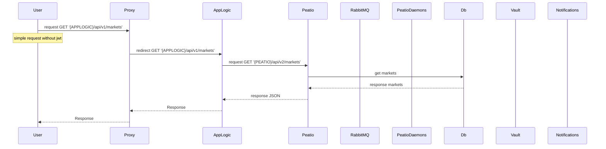

### Get tickers


### Get tickers for specified market

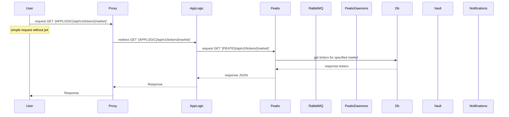

### Get order book for market

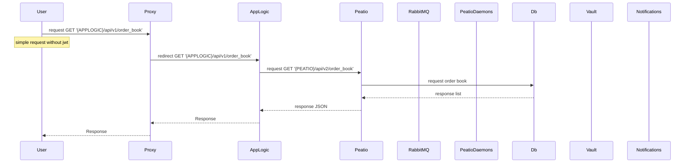

### Get depth

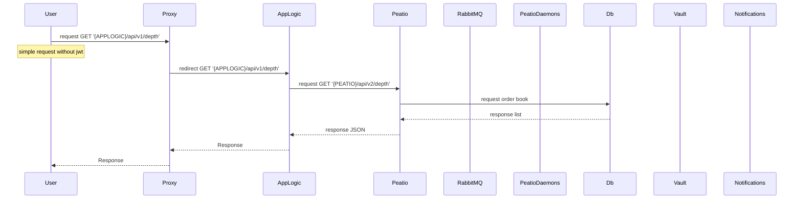

### Get recent trades on market

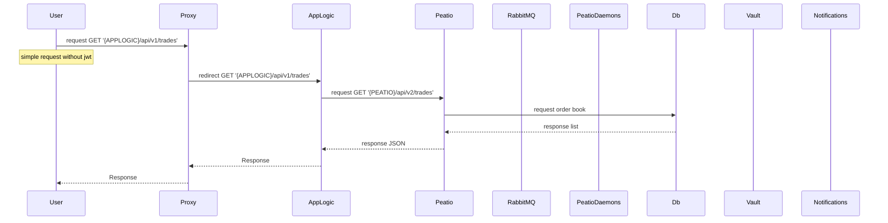

### Get OHLC(k line) of specific market

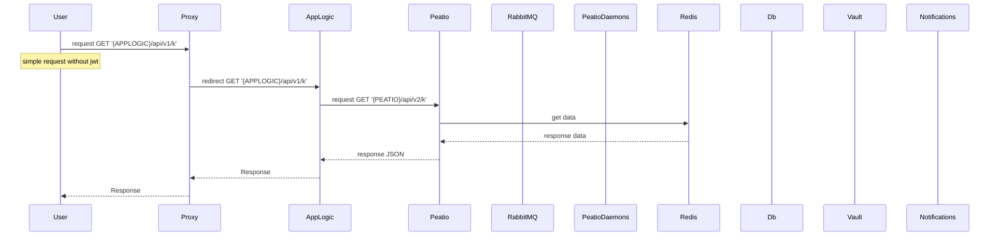

### Get fees (deposit/withdraw/trading)

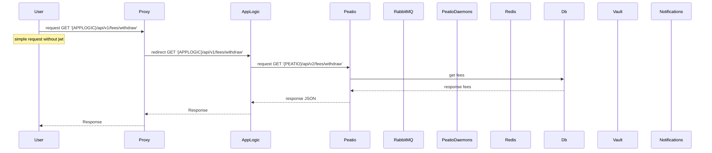

# Raised security API 

This section describes set of API of RKCP that needs additional confirmation on actions besides using session JWT and/or API keys

## Deposits: Fiats


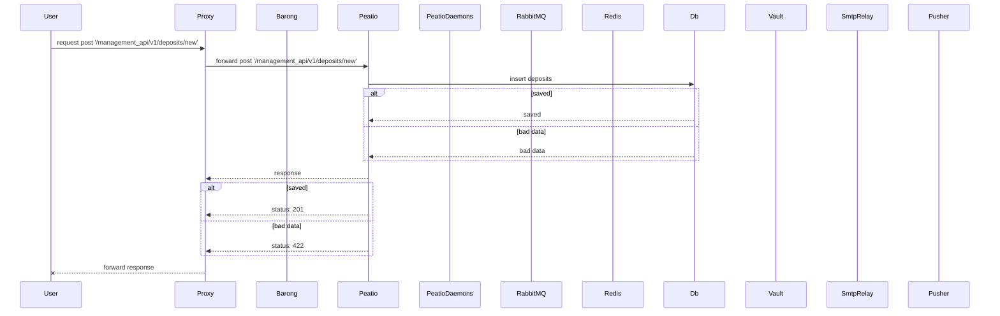

## Withdraws: Fiats

### User initiate new withdraw

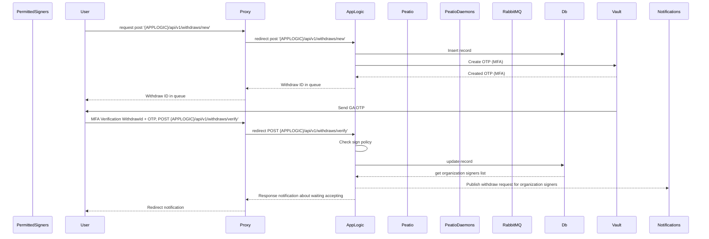

### Subscriber get withdraw request (for organization signers)


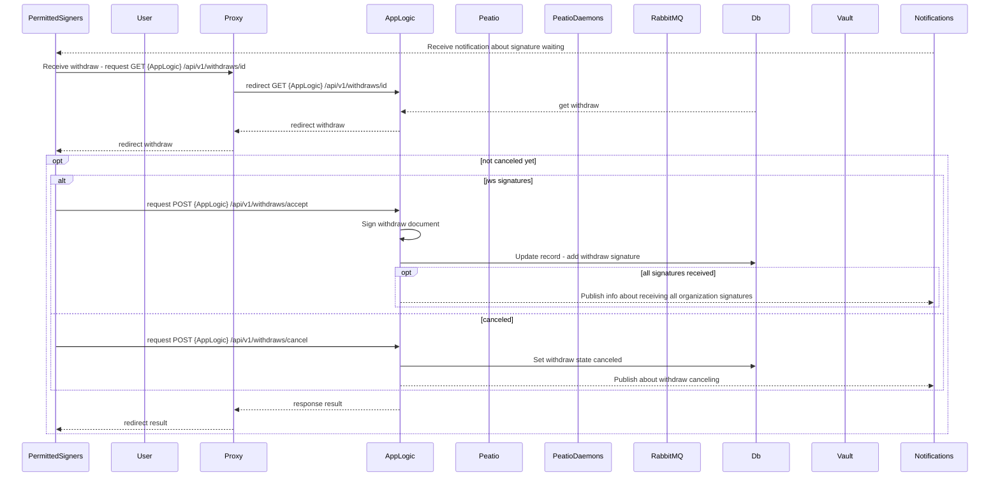

### All organization signatures received

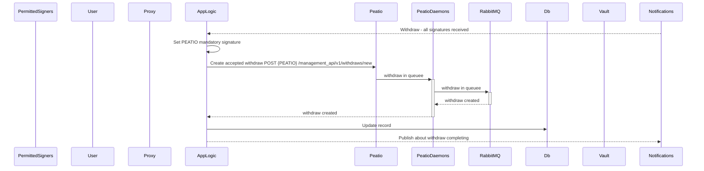

# Service processes

This section contains jwt authentification process

### JWT verification

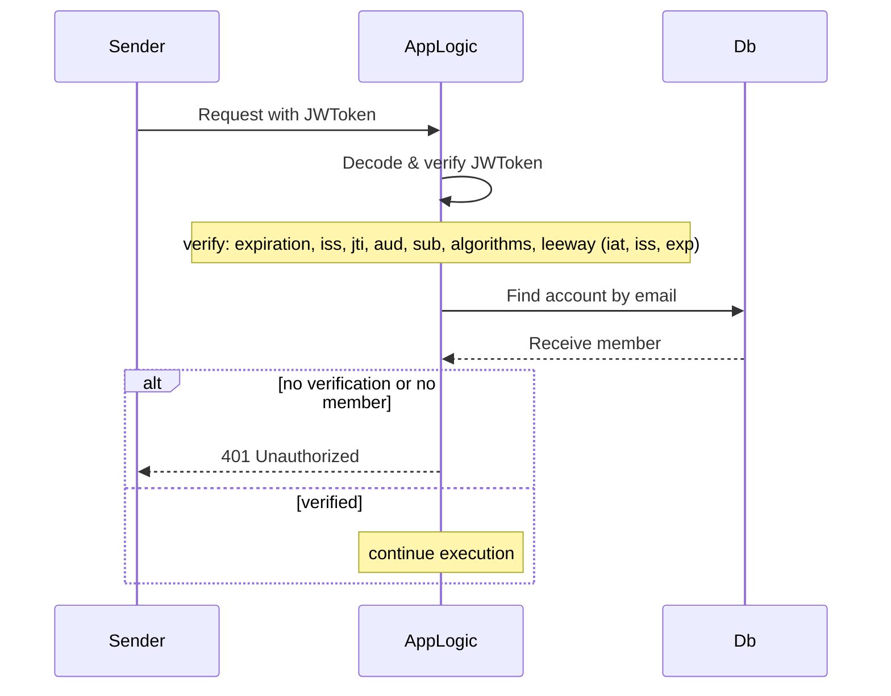
