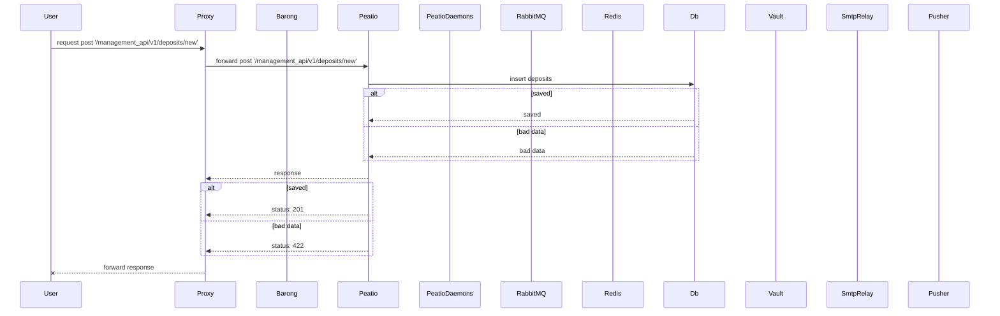
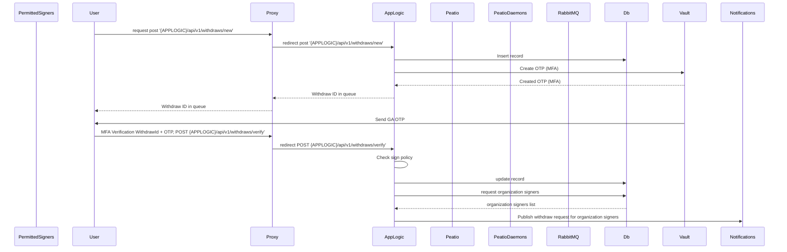
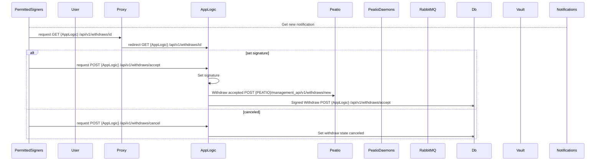
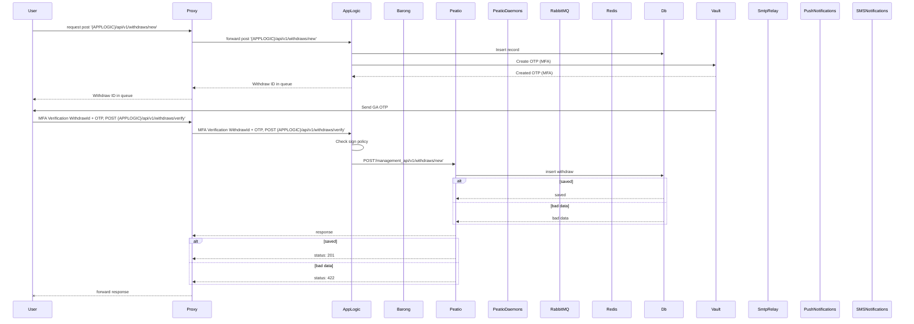

# Installation

To use CLI to render document, please install (depending on your system configuration, you may need to use `sudo`):

```
npm install -g markdown-cli-renderer
npm install -g babel-runtime
```

## Rendering document

To render current version just type:

`./render.sh`

## Viewing current documents


We recommend using MS VSCode for this:

https://code.visualstudio.com/download

With installed plugins:

* Mermaid preview
* Markdown Preview Mermaid support

After installing those plugins you should see something like this:


# Raised security API 

This section descripbes set of API of RKCP that needs additional confirmation on actions besides using session JWT and/or API keys

## Deposits: Fiats



## Withdraws: Fiats

### User initiate new withdraw



### Subscriber get withdraw request (for organization signers)



## (depricated) Withdraws: Fiats



