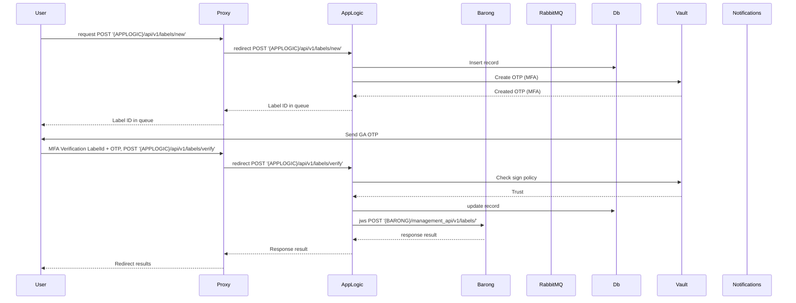
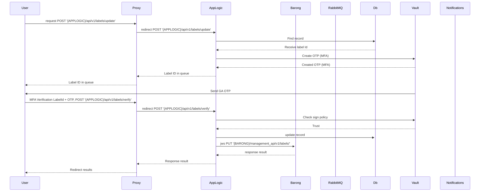
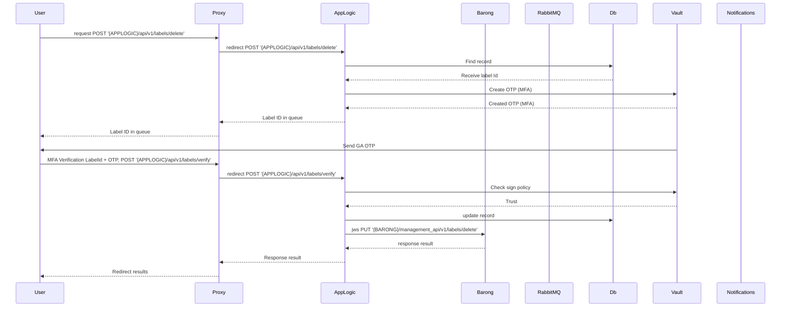

## Labels with 'private' scope

### Create a label with 'private' scope and assigns to account



```
sequenceDiagram
    participant User
    participant Proxy
    participant AppLogic
    participant Barong
    participant RabbitMQ
    participant Db
    participant Vault
    participant Notifications

    User->>Proxy: request POST '{APPLOGIC}/api/v1/labels/new'
    Proxy->>AppLogic: redirect POST '{APPLOGIC}/api/v1/labels/new'
    AppLogic->>Db: Insert record

    AppLogic->>Vault: Create OTP (MFA)
    Vault-->>AppLogic: Created OTP (MFA)
    AppLogic-->>Proxy: Label ID in queue
    Proxy-->>User: Label ID in queue

    Vault->>User: Send GA OTP
    User->>Proxy: MFA Verification LabelId + OTP, POST '{APPLOGIC}/api/v1/labels/verify'
    Proxy->>AppLogic: redirect POST '{APPLOGIC}/api/v1/labels/verify'

    AppLogic->>Vault: Check sign policy
    Vault-->>AppLogic: Trust

    AppLogic->>+Db: update record
    AppLogic->>+Barong: jws POST '{BARONG}/management_api/v1/labels/'
    Barong-->>AppLogic: response result
    AppLogic-->>Proxy: Response result
    Proxy-->>User: Redirect results
```

### Update label



```
sequenceDiagram
    participant User
    participant Proxy
    participant AppLogic
    participant Barong
    participant RabbitMQ
    participant Db
    participant Vault
    participant Notifications

    User->>Proxy: request POST '{APPLOGIC}/api/v1/labels/update'
    Proxy->>AppLogic: redirect POST '{APPLOGIC}/api/v1/labels/update'
    AppLogic->>Db: Find record
    Db-->>AppLogic: Receive label Id

    AppLogic->>Vault: Create OTP (MFA)
    Vault-->>AppLogic: Created OTP (MFA)
    AppLogic-->>Proxy: Label ID in queue
    Proxy-->>User: Label ID in queue

    Vault->>User: Send GA OTP
    User->>Proxy: MFA Verification LabelId + OTP, POST '{APPLOGIC}/api/v1/labels/verify'
    Proxy->>AppLogic: redirect POST '{APPLOGIC}/api/v1/labels/verify'

    AppLogic->>Vault: Check sign policy
    Vault-->>AppLogic: Trust

    AppLogic->>+Db: update record
    AppLogic->>+Barong: jws PUT '{BARONG}/management_api/v1/labels/'
    Barong-->>AppLogic: response result
    AppLogic-->>Proxy: Response result
    Proxy-->>User: Redirect results
```

### Delete label



```
sequenceDiagram
    participant User
    participant Proxy
    participant AppLogic
    participant Barong
    participant RabbitMQ
    participant Db
    participant Vault
    participant Notifications

    User->>Proxy: request POST '{APPLOGIC}/api/v1/labels/delete'
    Proxy->>AppLogic: redirect POST '{APPLOGIC}/api/v1/labels/delete'
    AppLogic->>Db: Find record
    Db-->>AppLogic: Receive label Id

    AppLogic->>Vault: Create OTP (MFA)
    Vault-->>AppLogic: Created OTP (MFA)
    AppLogic-->>Proxy: Label ID in queue
    Proxy-->>User: Label ID in queue

    Vault->>User: Send GA OTP
    User->>Proxy: MFA Verification LabelId + OTP, POST '{APPLOGIC}/api/v1/labels/verify'
    Proxy->>AppLogic: redirect POST '{APPLOGIC}/api/v1/labels/verify'

    AppLogic->>Vault: Check sign policy
    Vault-->>AppLogic: Trust

    AppLogic->>Db: update record
    AppLogic->>Barong: jws PUT '{BARONG}/management_api/v1/labels/delete'
    Barong-->>AppLogic: response result
    AppLogic-->>Proxy: Response result
    Proxy-->>User: Redirect results
```
