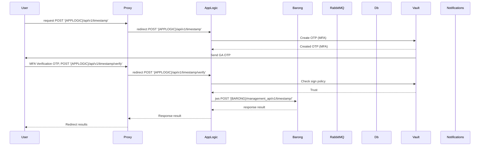

## Timestamp

### Receive server time in seconds since Unix epoch

This endpoint is useful for expiration syncronization and testing Management API



```
sequenceDiagram
    participant User
    participant Proxy
    participant AppLogic
    participant Barong
    participant RabbitMQ
    participant Db
    participant Vault
    participant Notifications

    User->>Proxy: request POST '{APPLOGIC}/api/v1/timestamp'
    Proxy->>AppLogic: redirect POST '{APPLOGIC}/api/v1/timestamp'
    
    AppLogic->>Vault: Create OTP (MFA)
    Vault-->>AppLogic: Created OTP (MFA)
    
    Vault->>User: Send GA OTP
    User->>Proxy: MFA Verification OTP, POST '{APPLOGIC}/api/v1/timestamp/verify'
    Proxy->>AppLogic: redirect POST '{APPLOGIC}/api/v1/timestamp/verify'

    AppLogic->>Vault: Check sign policy
    Vault-->>AppLogic: Trust

    AppLogic->>+Barong: jws POST '{BARONG}/management_api/v1/timestamp/'
    Barong-->>AppLogic: response result
    AppLogic-->>Proxy: Response result
    Proxy-->>User: Redirect results
```
