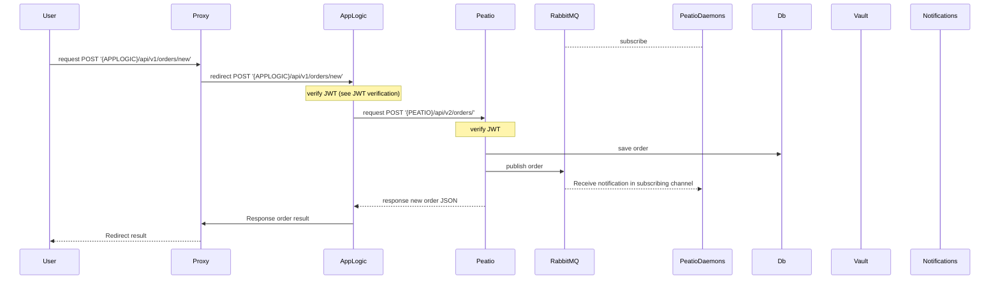
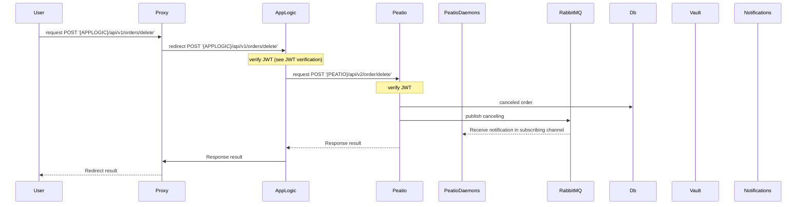

## Orders

### Create new order

```mermaid
sequenceDiagram
    participant User
    participant Proxy
    participant AppLogic
    participant Peatio
    participant RabbitMQ
    participant PeatioDaemons
    participant Db
    participant Vault
    participant Notifications

    PeatioDaemons-->RabbitMQ: subscribe
    User->>Proxy: request POST '{APPLOGIC}/api/v1/orders/new'
    Proxy->>AppLogic: redirect POST '{APPLOGIC}/api/v1/orders/new'
    Note over AppLogic: verify JWT (see JWT verification)
    AppLogic->>Peatio: request POST '{PEATIO}/api/v2/orders/'
    Note over Peatio: verify JWT
    Peatio->>Db: save order
    Peatio->>RabbitMQ: publish order
    RabbitMQ-->>PeatioDaemons: Receive notification in subscribing channel
    Peatio-->>AppLogic: response new order JSON

    AppLogic->>Proxy: Response order result
    Proxy-->>User: Redirect result
```

### Delete order

```mermaid
sequenceDiagram
    participant User
    participant Proxy
    participant AppLogic
    participant Peatio
    participant PeatioDaemons
    participant RabbitMQ
    participant Db
    participant Vault
    participant Notifications

    User->>Proxy: request POST '{APPLOGIC}/api/v1/orders/delete'
    Proxy->>AppLogic: redirect POST '{APPLOGIC}/api/v1/orders/delete'
    Note over AppLogic: verify JWT (see JWT verification)
    AppLogic->>Peatio: request POST '{PEATIO}/api/v2/order/delete'
    Note over Peatio: verify JWT
    Peatio->>Db: canceled order
    Peatio->>RabbitMQ: publish canceling
    RabbitMQ-->>PeatioDaemons: Receive notification in subscribing channel

    Peatio-->>AppLogic: Response result

    AppLogic->>Proxy: Response result
    Proxy-->>User: Redirect result
```