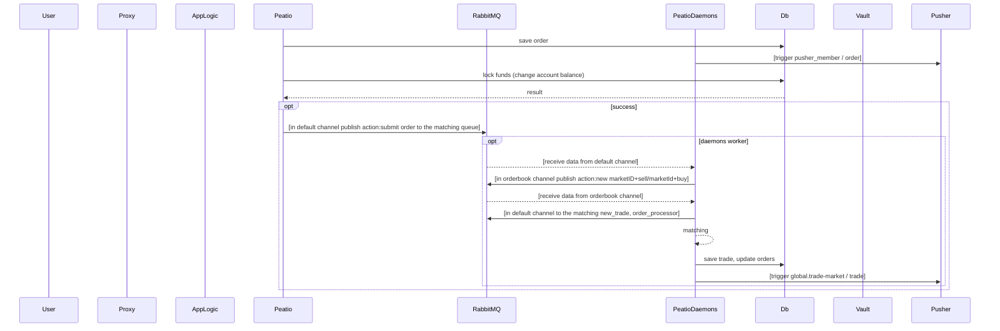
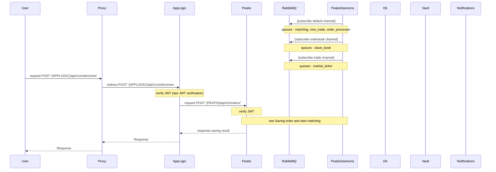
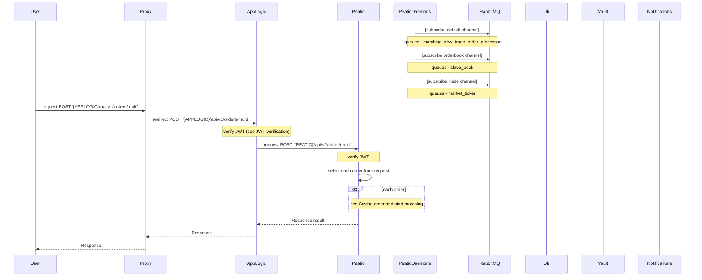
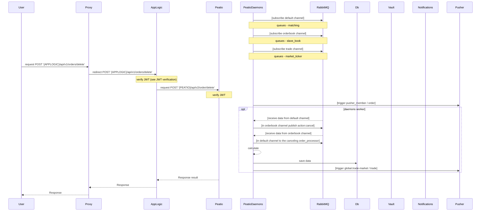
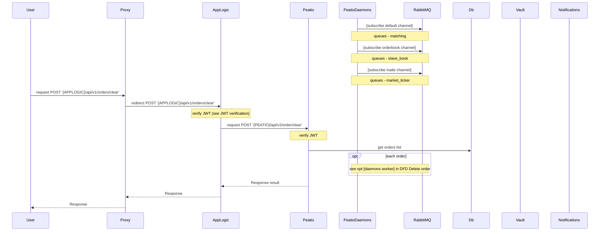
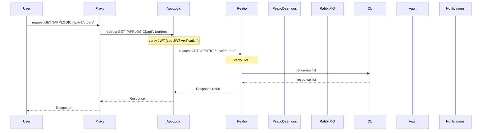
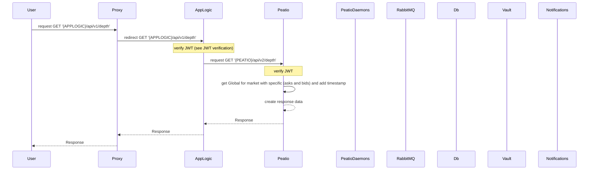
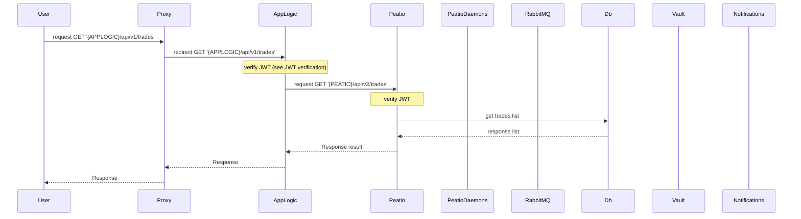

## Orders

### Saving order and start matching
This is common process when add new order (from api)



```
sequenceDiagram
    participant User
    participant Proxy
    participant AppLogic
    participant Peatio
    participant RabbitMQ
    participant PeatioDaemons
    participant Db
    participant Vault
    participant Pusher

    Peatio->>Db: save order
    PeatioDaemons->>Pusher: [trigger pusher_member / order]
    Peatio->>Db: lock funds (change account balance)
    Db-->>Peatio: result
    opt success
        Peatio->>RabbitMQ: [in default channel publish action:submit order to the matching queue]
        opt daemons worker
            RabbitMQ-->>PeatioDaemons: [receive data from default channel]
            PeatioDaemons->>RabbitMQ: [in orderbook channel publish action:new marketID+sell/marketId+buy]
            RabbitMQ-->>PeatioDaemons: [receive data from orderbook channel]
            PeatioDaemons->>RabbitMQ: [in default channel to the matching new_trade, order_processor]
            PeatioDaemons-->>PeatioDaemons: matching
            PeatioDaemons->>Db: save trade, update orders
            PeatioDaemons->>Pusher: [trigger global.trade-market / trade]
        end
    end
```

### Create new order



```
sequenceDiagram
    participant User
    participant Proxy
    participant AppLogic
    participant Peatio
    participant RabbitMQ
    participant PeatioDaemons
    participant Db
    participant Vault
    participant Notifications

    PeatioDaemons->>RabbitMQ: [subscribe default channel]
    Note over PeatioDaemons,RabbitMQ: queues - matching, new_trade, order_processor
    PeatioDaemons->>RabbitMQ: [subscribe orderbook channel]
    Note over PeatioDaemons,RabbitMQ: queues - slave_book
    PeatioDaemons->>RabbitMQ: [subscribe trade channel]
    Note over PeatioDaemons,RabbitMQ: queues - market_ticker
    User->>Proxy: request POST '{APPLOGIC}/api/v1/orders/new'
    Proxy->>AppLogic: redirect POST '{APPLOGIC}/api/v1/orders/new'
    Note over AppLogic: verify JWT (see JWT verification)
    AppLogic->>Peatio: request POST '{PEATIO}/api/v2/orders/'
    Note over Peatio: verify JWT
    Note over Peatio, PeatioDaemons: see Saving order and start matching
    Peatio-->>AppLogic: response saving result
    AppLogic-->>Proxy: Response
    Proxy-->>User: Response
```

### Create multi orders



```
sequenceDiagram
    participant User
    participant Proxy
    participant AppLogic
    participant Peatio
    participant PeatioDaemons
    participant RabbitMQ
    participant Db
    participant Vault
    participant Notifications

    PeatioDaemons->>RabbitMQ: [subscribe default channel]
    Note over PeatioDaemons,RabbitMQ: queues - matching, new_trade, order_processor
    PeatioDaemons->>RabbitMQ: [subscribe orderbook channel]
    Note over PeatioDaemons,RabbitMQ: queues - slave_book
    PeatioDaemons->>RabbitMQ: [subscribe trade channel]
    Note over PeatioDaemons,RabbitMQ: queues - market_ticker

    User->>Proxy: request POST '{APPLOGIC}/api/v1/orders/multi'
    Proxy->>AppLogic: redirect POST '{APPLOGIC}/api/v1/orders/multi'
    Note over AppLogic: verify JWT (see JWT verification)
    AppLogic->>Peatio: request POST '{PEATIO}/api/v2/order/multi'
    Note over Peatio: verify JWT
    Peatio->>Peatio: select each order from request
    opt each order
        Note over Peatio, PeatioDaemons: see Saving order and start matching
    end

    Peatio-->>AppLogic: Response result

    AppLogic-->>Proxy: Response
    Proxy-->>User: Response
```

### Delete order



```
sequenceDiagram
    participant User
    participant Proxy
    participant AppLogic
    participant Peatio
    participant PeatioDaemons
    participant RabbitMQ
    participant Db
    participant Vault
    participant Notifications

    PeatioDaemons->>RabbitMQ: [subscribe default channel]
    Note over PeatioDaemons,RabbitMQ: queues - matching
    PeatioDaemons->>RabbitMQ: [subscribe orderbook channel]
    Note over PeatioDaemons,RabbitMQ: queues - slave_book
    PeatioDaemons->>RabbitMQ: [subscribe trade channel]
    Note over PeatioDaemons,RabbitMQ: queues - market_ticker

    User->>Proxy: request POST '{APPLOGIC}/api/v1/orders/delete'
    Proxy->>AppLogic: redirect POST '{APPLOGIC}/api/v1/orders/delete'
    Note over AppLogic: verify JWT (see JWT verification)
    AppLogic->>Peatio: request POST '{PEATIO}/api/v2/order/delete'
    Note over Peatio: verify JWT
    PeatioDaemons->>Pusher: [trigger pusher_member / order]
    opt daemons worker
        RabbitMQ-->>PeatioDaemons: [receive data from default channel]
        PeatioDaemons->>RabbitMQ: [in orderbook channel publish action:cancel]
        RabbitMQ-->>PeatioDaemons: [receive data from orderbook channel]
        PeatioDaemons->>RabbitMQ: [in default channel to the canceling order_processor]
        PeatioDaemons-->>PeatioDaemons: calculate
        PeatioDaemons->>Db: save data
        PeatioDaemons->>Pusher: [trigger global.trade-market / trade]
    end

    Peatio-->>AppLogic: Response result

    AppLogic-->>Proxy: Response
    Proxy-->>User: Response
```

### Clear all orders



```
sequenceDiagram
    participant User
    participant Proxy
    participant AppLogic
    participant Peatio
    participant PeatioDaemons
    participant RabbitMQ
    participant Db
    participant Vault
    participant Notifications

    PeatioDaemons->>RabbitMQ: [subscribe default channel]
    Note over PeatioDaemons,RabbitMQ: queues - matching
    PeatioDaemons->>RabbitMQ: [subscribe orderbook channel]
    Note over PeatioDaemons,RabbitMQ: queues - slave_book
    PeatioDaemons->>RabbitMQ: [subscribe trade channel]
    Note over PeatioDaemons,RabbitMQ: queues - market_ticker

    User->>Proxy: request POST '{APPLOGIC}/api/v1/orders/clear'
    Proxy->>AppLogic: redirect POST '{APPLOGIC}/api/v1/orders/clear'
    Note over AppLogic: verify JWT (see JWT verification)
    AppLogic->>Peatio: request POST '{PEATIO}/api/v2/order/clear'
    Note over Peatio: verify JWT
    Peatio->>Db: get orders list
    opt each order
        Note over PeatioDaemons,RabbitMQ: see opt [daemons worker] in DFD Delete order
    end

    Peatio-->>AppLogic: Response result

    AppLogic-->>Proxy: Response
    Proxy-->>User: Response
```

### Get orders list



```
sequenceDiagram
    participant User
    participant Proxy
    participant AppLogic
    participant Peatio
    participant PeatioDaemons
    participant RabbitMQ
    participant Db
    participant Vault
    participant Notifications

    User->>Proxy: request GET '{APPLOGIC}/api/v1/orders'
    Proxy->>AppLogic: redirect GET '{APPLOGIC}/api/v1/orders'
    Note over AppLogic: verify JWT (see JWT verification)
    AppLogic->>Peatio: request GET '{PEATIO}/api/v2/orders'
    Note over Peatio: verify JWT
    Peatio->>Db: get orders list
    Db-->>Peatio: response list

    Peatio-->>AppLogic: Response result

    AppLogic-->>Proxy: Response
    Proxy-->>User: Response
```

### Get order detail


```
sequenceDiagram
    participant User
    participant Proxy
    participant AppLogic
    participant Peatio
    participant PeatioDaemons
    participant RabbitMQ
    participant Db
    participant Vault
    participant Notifications

    User->>Proxy: request GET '{APPLOGIC}/api/v1/order'
    Proxy->>AppLogic: redirect GET '{APPLOGIC}/api/v1/order'
    Note over AppLogic: verify JWT (see JWT verification)
    AppLogic->>Peatio: request GET '{PEATIO}/api/v2/order'
    Note over Peatio: verify JWT
    Peatio->>Db: get order details
    Db-->>Peatio: response order

    Peatio-->>AppLogic: Response result

    AppLogic-->>Proxy: Response
    Proxy-->>User: Response
```

### Get the order book of specified market

```mermaid
sequenceDiagram
    participant User
    participant Proxy
    participant AppLogic
    participant Peatio
    participant PeatioDaemons
    participant RabbitMQ
    participant Db
    participant Vault
    participant Notifications

    User->>Proxy: request GET '{APPLOGIC}/api/v1/order_book'
    Proxy->>AppLogic: redirect GET '{APPLOGIC}/api/v1/order_book'
    Note over AppLogic: verify JWT (see JWT verification)
    AppLogic->>Peatio: request GET '{PEATIO}/api/v2/order_book'
    Note over Peatio: verify JWT
    Peatio->>+Db: get orders (asks)
    Peatio->>+Db: get orders (bids)
    Peatio->>-Db: response asks
    Peatio->>-Db: response bids
    Peatio-->>Peatio: create response array

    Peatio-->>AppLogic: Response

    AppLogic-->>Proxy: Response
    Proxy-->>User: Response
```

```
sequenceDiagram
    participant User
    participant Proxy
    participant AppLogic
    participant Peatio
    participant PeatioDaemons
    participant RabbitMQ
    participant Db
    participant Vault
    participant Notifications

    User->>Proxy: request GET '{APPLOGIC}/api/v1/order_book'
    Proxy->>AppLogic: redirect GET '{APPLOGIC}/api/v1/order_book'
    Note over AppLogic: verify JWT (see JWT verification)
    AppLogic->>Peatio: request GET '{PEATIO}/api/v2/order_book'
    Note over Peatio: verify JWT
    Peatio->>+Db: get orders (asks)
    Peatio->>+Db: get orders (bids)
    Peatio->>-Db: response asks
    Peatio->>-Db: response bids
    Peatio-->>Peatio: create response array

    Peatio-->>AppLogic: Response

    AppLogic-->>Proxy: Response
    Proxy-->>User: Response
```

### Get depth or specified market



```
sequenceDiagram
    participant User
    participant Proxy
    participant AppLogic
    participant Peatio
    participant PeatioDaemons
    participant RabbitMQ
    participant Db
    participant Vault
    participant Notifications

    User->>Proxy: request GET '{APPLOGIC}/api/v1/depth'
    Proxy->>AppLogic: redirect GET '{APPLOGIC}/api/v1/depth'
    Note over AppLogic: verify JWT (see JWT verification)
    AppLogic->>Peatio: request GET '{PEATIO}/api/v2/depth'
    Note over Peatio: verify JWT
    Peatio->>Peatio: get Global for market with specific (asks and bids) and add timestamp
    Peatio-->>Peatio: create response data

    Peatio-->>AppLogic: Response

    AppLogic-->>Proxy: Response
    Proxy-->>User: Response
```

### Get members executed trades



```
sequenceDiagram
    participant User
    participant Proxy
    participant AppLogic
    participant Peatio
    participant PeatioDaemons
    participant RabbitMQ
    participant Db
    participant Vault
    participant Notifications

    User->>Proxy: request GET '{APPLOGIC}/api/v1/trades'
    Proxy->>AppLogic: redirect GET '{APPLOGIC}/api/v1/trades'
    Note over AppLogic: verify JWT (see JWT verification)
    AppLogic->>Peatio: request GET '{PEATIO}/api/v2/trades'
    Note over Peatio: verify JWT
    Peatio->>Db: get trades list
    Db-->>Peatio: response list

    Peatio-->>AppLogic: Response result

    AppLogic-->>Proxy: Response
    Proxy-->>User: Response
```
