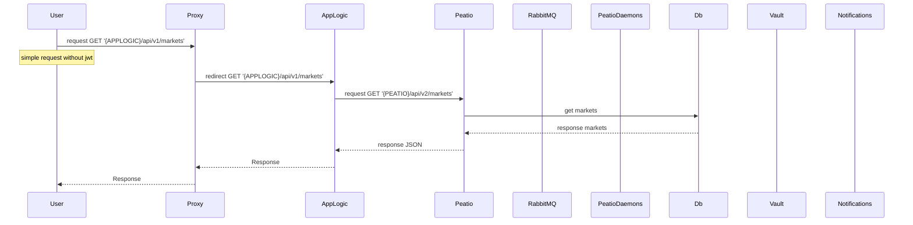
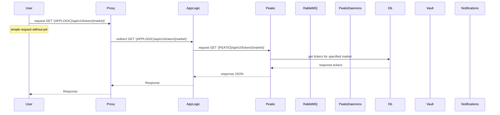
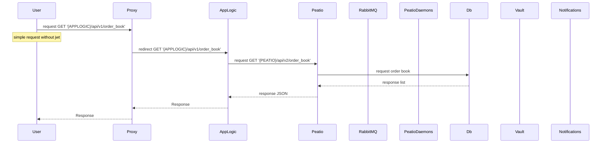
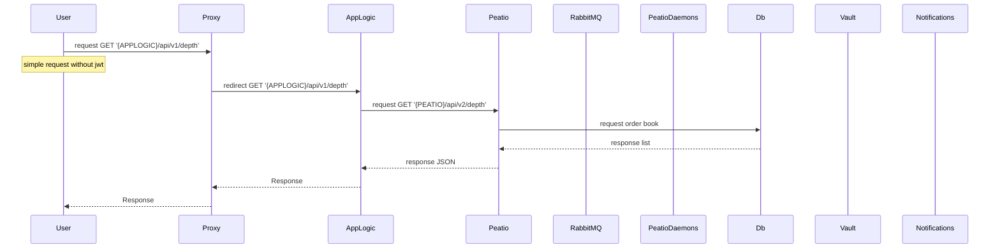
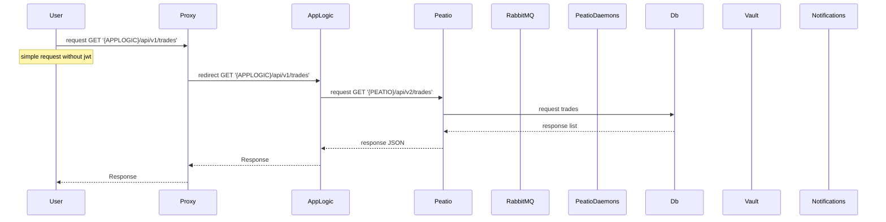
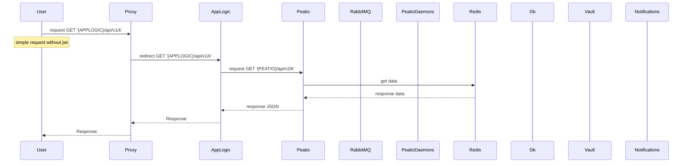
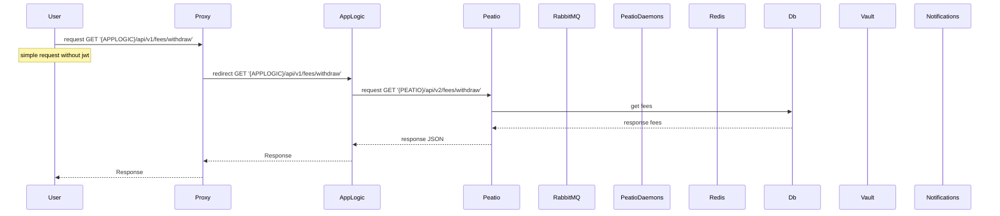

## Public data

### Get markets list



```
sequenceDiagram
    participant User
    participant Proxy
    participant AppLogic
    participant Peatio
    participant RabbitMQ
    participant PeatioDaemons
    participant Db
    participant Vault
    participant Notifications

    User->>Proxy: request GET '{APPLOGIC}/api/v1/markets'
    Note over User: simple request without jwt
    Proxy->>AppLogic: redirect GET '{APPLOGIC}/api/v1/markets'
    AppLogic->>Peatio: request GET '{PEATIO}/api/v2/markets'
    Peatio->>Db: get markets
    Db-->>Peatio: response markets
    Peatio-->>AppLogic: response JSON

    AppLogic-->>Proxy: Response
    Proxy-->>User: Response
```

### Get tickers


```
sequenceDiagram
    participant User
    participant Proxy
    participant AppLogic
    participant Peatio
    participant RabbitMQ
    participant PeatioDaemons
    participant Db
    participant Vault
    participant Notifications

    User->>Proxy: request GET '{APPLOGIC}/api/v1/tickers'
    Note over User: simple request without jwt
    Proxy->>AppLogic: redirect GET '{APPLOGIC}/api/v1/tickers'
    AppLogic->>Peatio: request GET '{PEATIO}/api/v2/tickers'
    Peatio->>Db: get tickers
    Db-->>Peatio: response tickers
    Peatio-->>AppLogic: response JSON

    AppLogic-->>Proxy: Response
    Proxy-->>User: Response
```

### Get tickers for specified market



```
sequenceDiagram
    participant User
    participant Proxy
    participant AppLogic
    participant Peatio
    participant RabbitMQ
    participant PeatioDaemons
    participant Db
    participant Vault
    participant Notifications

    User->>Proxy: request GET '{APPLOGIC}/api/v1/tickers/{market}'
    Note over User: simple request without jwt
    Proxy->>AppLogic: redirect GET '{APPLOGIC}/api/v1/tickers/{market}'
    AppLogic->>Peatio: request GET '{PEATIO}/api/v2/tickers/{market}'
    Peatio->>Db: get tickers for specified market
    Db-->>Peatio: response tickers
    Peatio-->>AppLogic: response JSON

    AppLogic-->>Proxy: Response
    Proxy-->>User: Response
```

### Get order book for market



```
sequenceDiagram
    participant User
    participant Proxy
    participant AppLogic
    participant Peatio
    participant RabbitMQ
    participant PeatioDaemons
    participant Db
    participant Vault
    participant Notifications

    User->>Proxy: request GET '{APPLOGIC}/api/v1/order_book'
    Note over User: simple request without jwt
    Proxy->>AppLogic: redirect GET '{APPLOGIC}/api/v1/order_book'
    AppLogic->>Peatio: request GET '{PEATIO}/api/v2/order_book'
    Peatio->>Db: request order book
    Db-->>Peatio: response list
    Peatio-->>AppLogic: response JSON

    AppLogic-->>Proxy: Response
    Proxy-->>User: Response
```

### Get depth



```
sequenceDiagram
    participant User
    participant Proxy
    participant AppLogic
    participant Peatio
    participant RabbitMQ
    participant PeatioDaemons
    participant Db
    participant Vault
    participant Notifications

    User->>Proxy: request GET '{APPLOGIC}/api/v1/depth'
    Note over User: simple request without jwt
    Proxy->>AppLogic: redirect GET '{APPLOGIC}/api/v1/depth'
    AppLogic->>Peatio: request GET '{PEATIO}/api/v2/depth'
    Peatio->>Db: request order book
    Db-->>Peatio: response list
    Peatio-->>AppLogic: response JSON

    AppLogic-->>Proxy: Response
    Proxy-->>User: Response
```

### Get recent trades on market



```
sequenceDiagram
    participant User
    participant Proxy
    participant AppLogic
    participant Peatio
    participant RabbitMQ
    participant PeatioDaemons
    participant Db
    participant Vault
    participant Notifications

    User->>Proxy: request GET '{APPLOGIC}/api/v1/trades'
    Note over User: simple request without jwt
    Proxy->>AppLogic: redirect GET '{APPLOGIC}/api/v1/trades'
    AppLogic->>Peatio: request GET '{PEATIO}/api/v2/trades'
    Peatio->>Db: request trades
    Db-->>Peatio: response list
    Peatio-->>AppLogic: response JSON

    AppLogic-->>Proxy: Response
    Proxy-->>User: Response
```

### Get OHLC(k line) of specific market



```
sequenceDiagram
    participant User
    participant Proxy
    participant AppLogic
    participant Peatio
    participant RabbitMQ
    participant PeatioDaemons
    participant Redis
    participant Db
    participant Vault
    participant Notifications

    User->>Proxy: request GET '{APPLOGIC}/api/v1/k'
    Note over User: simple request without jwt
    Proxy->>AppLogic: redirect GET '{APPLOGIC}/api/v1/k'
    AppLogic->>Peatio: request GET '{PEATIO}/api/v2/k'
    Peatio->>Redis: get data
    Redis-->>Peatio: response data
    Peatio-->>AppLogic: response JSON

    AppLogic-->>Proxy: Response
    Proxy-->>User: Response
```

### Get fees (deposit/withdraw/trading)
Those endpoints is avaible in Peatio 1.8



```
sequenceDiagram
    participant User
    participant Proxy
    participant AppLogic
    participant Peatio
    participant RabbitMQ
    participant PeatioDaemons
    participant Redis
    participant Db
    participant Vault
    participant Notifications

    User->>Proxy: request GET '{APPLOGIC}/api/v1/fees/withdraw'
    Note over User: simple request without jwt
    Proxy->>AppLogic: redirect GET '{APPLOGIC}/api/v1/fees/withdraw'
    AppLogic->>Peatio: request GET '{PEATIO}/api/v2/fees/withdraw'
    Peatio->>Db: get fees
    Db-->>Peatio: response fees
    Peatio-->>AppLogic: response JSON

    AppLogic-->>Proxy: Response
    Proxy-->>User: Response
```
