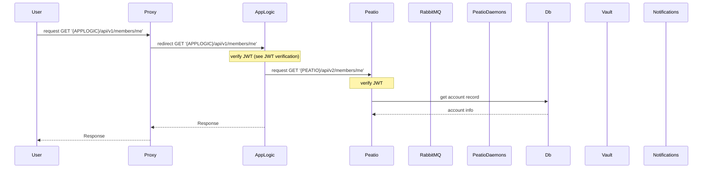
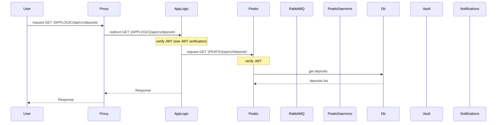
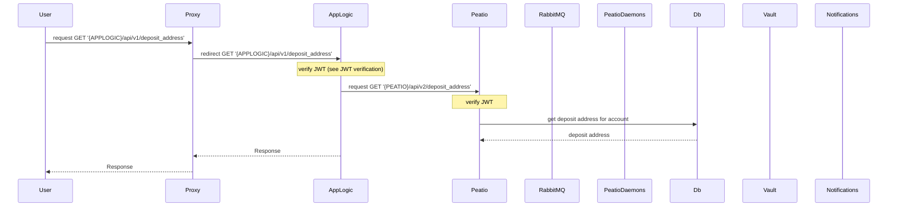

## Account's data

### Get your profile and accounts info

```mermaid
sequenceDiagram
    participant User
    participant Proxy
    participant AppLogic
    participant Peatio
    participant RabbitMQ
    participant PeatioDaemons
    participant Db
    participant Vault
    participant Notifications

    User->>Proxy: request GET '{APPLOGIC}/api/v1/members/me'
    Proxy->>AppLogic: redirect GET '{APPLOGIC}/api/v1/members/me'
    Note over AppLogic: verify JWT (see JWT verification)
    AppLogic->>Peatio: request GET '{PEATIO}/api/v2/members/me'
    Note over Peatio: verify JWT
    Peatio->>Db: get account record
    Db-->>Peatio: account info
    AppLogic-->>Proxy: Response
    Proxy-->>User: Response
```

### Get your deposits history

```mermaid
sequenceDiagram
    participant User
    participant Proxy
    participant AppLogic
    participant Peatio
    participant RabbitMQ
    participant PeatioDaemons
    participant Db
    participant Vault
    participant Notifications

    User->>Proxy: request GET '{APPLOGIC}/api/v1/deposits'
    Proxy->>AppLogic: redirect GET '{APPLOGIC}/api/v1/deposits'
    Note over AppLogic: verify JWT (see JWT verification)
    AppLogic->>Peatio: request GET '{PEATIO}/api/v2/deposits'
    Note over Peatio: verify JWT
    Peatio->>Db: get deposits
    Db-->>Peatio: deposits list
    AppLogic-->>Proxy: Response
    Proxy-->>User: Response
```

### Get your deposit address

```mermaid
sequenceDiagram
    participant User
    participant Proxy
    participant AppLogic
    participant Peatio
    participant RabbitMQ
    participant PeatioDaemons
    participant Db
    participant Vault
    participant Notifications

    User->>Proxy: request GET '{APPLOGIC}/api/v1/deposit_address'
    Proxy->>AppLogic: redirect GET '{APPLOGIC}/api/v1/deposit_address'
    Note over AppLogic: verify JWT (see JWT verification)
    AppLogic->>Peatio: request GET '{PEATIO}/api/v2/deposit_address'
    Note over Peatio: verify JWT
    Peatio->>Db: get deposit address for account
    Db-->>Peatio: deposit address
    AppLogic-->>Proxy: Response
    Proxy-->>User: Response
```
