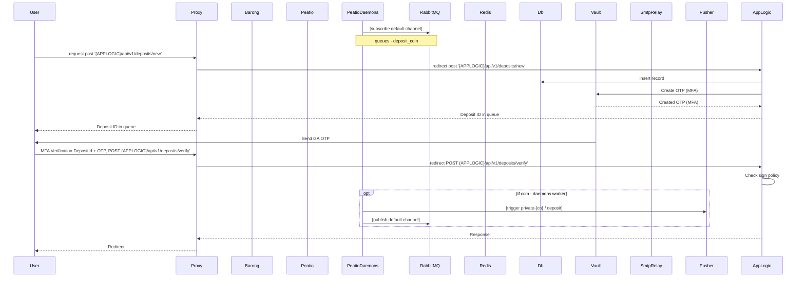

## Deposits: Fiats
This version is not realizing in Peatio



```
sequenceDiagram
    participant User
    participant Proxy
    participant Barong
    participant Peatio
    participant PeatioDaemons
    participant RabbitMQ
    participant Redis
    participant Db
    participant Vault
    participant SmtpRelay
    participant Pusher

    PeatioDaemons->>RabbitMQ: [subscribe default channel]
    Note over PeatioDaemons,RabbitMQ: queues - deposit_coin
    User->>Proxy: request post '{APPLOGIC}/api/v1/deposits/new'
    Proxy->>AppLogic: redirect post '{APPLOGIC}/api/v1/deposits/new'
    AppLogic->>Db: Insert record

    AppLogic->>Vault: Create OTP (MFA)
    Vault-->>AppLogic: Created OTP (MFA)
    AppLogic-->>Proxy: Deposit ID in queue
    Proxy-->>User: Deposit ID in queue

    Vault->>User: Send GA OTP
    User->>Proxy: MFA Verification DepositId + OTP, POST {APPLOGIC}/api/v1/deposits/verify'
    Proxy->>AppLogic: redirect POST {APPLOGIC}/api/v1/deposits/verify'

    AppLogic->AppLogic: Check sign policy
    opt if coin - daemons worker
        PeatioDaemons->>Pusher: [trigger private-{cn} / deposit]
        PeatioDaemons->>RabbitMQ: [publish default channel]
    end
    AppLogic-->>Proxy: Response
    Proxy-->>User: Redirect
```

