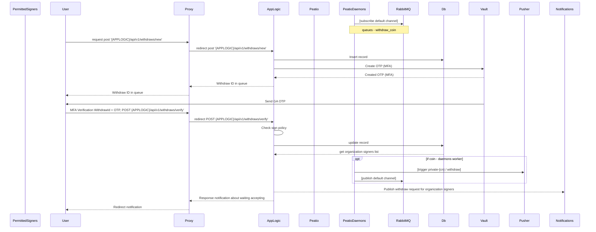
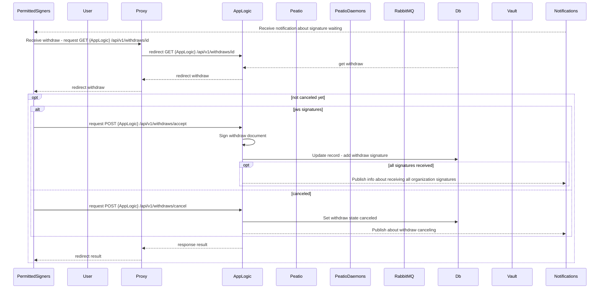
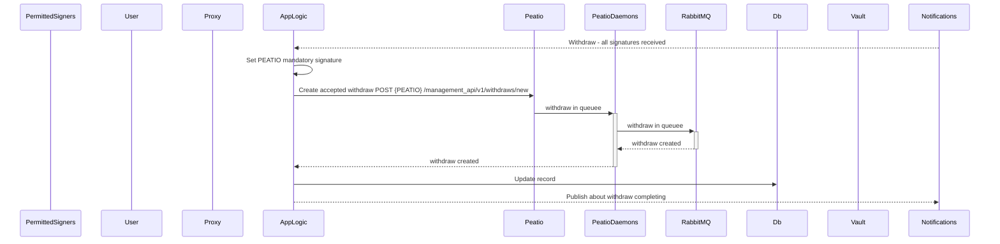

## Withdraws: Fiats

### User initiate new withdraw
This version is not realizing in Peatio



```
sequenceDiagram
    participant PermittedSigners
    participant User
    participant Proxy
    participant AppLogic
    participant Peatio
    participant PeatioDaemons
    participant RabbitMQ
    participant Db
    participant Vault
    participant Pusher

    PeatioDaemons->>RabbitMQ: [subscribe default channel]
    Note over PeatioDaemons,RabbitMQ: queues - withdraw_coin
    User->>Proxy: request post '{APPLOGIC}/api/v1/withdraws/new'
    Proxy->>AppLogic: redirect post '{APPLOGIC}/api/v1/withdraws/new'
    AppLogic->>Db: Insert record

    AppLogic->>Vault: Create OTP (MFA)
    Vault-->>AppLogic: Created OTP (MFA)
    AppLogic-->>Proxy: Withdraw ID in queue
    Proxy-->>User: Withdraw ID in queue

    Vault->>User: Send GA OTP
    User->>Proxy: MFA Verification WithdrawId + OTP, POST {APPLOGIC}/api/v1/withdraws/verify'
    Proxy->>AppLogic: redirect POST {APPLOGIC}/api/v1/withdraws/verify'

    AppLogic->AppLogic: Check sign policy

    AppLogic->>Db: update record
    Db-->>AppLogic: get organization signers list
    opt if coin - daemons worker
        PeatioDaemons->>Pusher: [trigger private-{cn} / withdraw]
        PeatioDaemons->>RabbitMQ: [publish default channel]
    end
    AppLogic-->>Notifications: Publish withdraw request for organization signers
    AppLogic-->>Proxy: Response notification about waiting accepting
    Proxy-->>User: Redirect notification
```

### Subscriber get withdraw request (for organization signers)




```
sequenceDiagram
    participant PermittedSigners
    participant User
    participant Proxy
    participant AppLogic
    participant Peatio
    participant PeatioDaemons
    participant RabbitMQ
    participant Db
    participant Vault
    participant Notifications

    Notifications-->>PermittedSigners: Receive notification about signature waiting

    PermittedSigners->>Proxy: Receive withdraw - request GET {AppLogic} /api/v1/withdraws/id
    Proxy->>AppLogic: redirect GET {AppLogic} /api/v1/withdraws/id

    Db-->>AppLogic: get withdraw
    AppLogic-->>Proxy: redirect withdraw
    Proxy-->>PermittedSigners: redirect withdraw

    opt not canceled yet
        alt jws signatures
            PermittedSigners->>AppLogic: request POST {AppLogic} /api/v1/withdraws/accept
            AppLogic->>AppLogic: Sign withdraw document
            AppLogic->>Db: Update record - add withdraw signature
            opt all signatures received
                AppLogic-->>Notifications: Publish info about receiving all organization signatures
            end
        else canceled
            PermittedSigners->>AppLogic: request POST {AppLogic} /api/v1/withdraws/cancel
            AppLogic->>Db: Set withdraw state canceled
            AppLogic-->>Notifications: Publish about withdraw canceling
        end
        AppLogic-->>Proxy: response result
        Proxy-->>PermittedSigners: redirect result
    end
```

### All organization signatures received



```
sequenceDiagram
    participant PermittedSigners
    participant User
    participant Proxy
    participant AppLogic
    participant Peatio
    participant PeatioDaemons
    participant RabbitMQ
    participant Db
    participant Vault
    participant Notifications
    
    Notifications-->>AppLogic: Withdraw - all signatures received
    AppLogic->>AppLogic: Set PEATIO mandatory signature
    AppLogic->>Peatio: Create accepted withdraw POST {PEATIO} /management_api/v1/withdraws/new
    Peatio->>+PeatioDaemons: withdraw in queuee
    PeatioDaemons->>+RabbitMQ: withdraw in queuee
    RabbitMQ-->>-PeatioDaemons: withdraw created
    PeatioDaemons-->>-AppLogic: withdraw created
    AppLogic->>Db: Update record
    AppLogic-->>Notifications: Publish about withdraw completing
```
