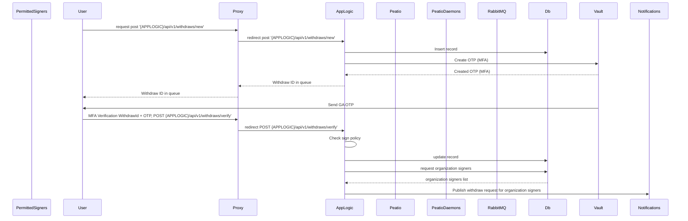
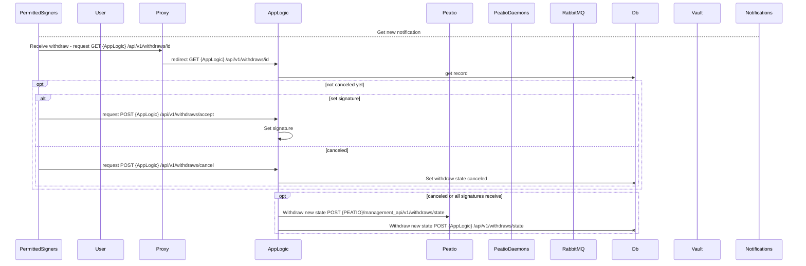
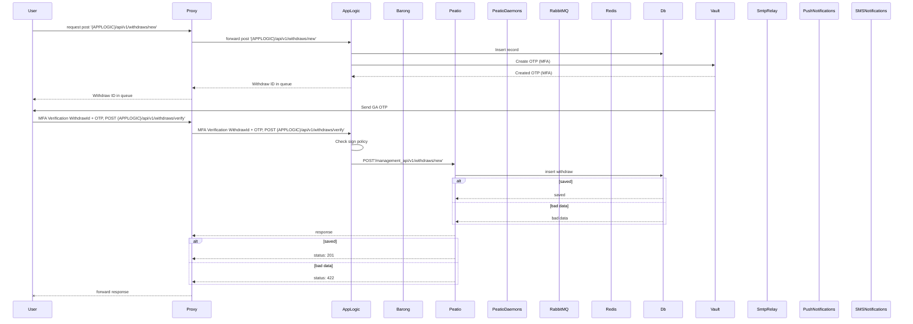

## Withdraws: Fiats

### User initiate new withdraw

```mermaid
sequenceDiagram
    participant PermittedSigners
    participant User
    participant Proxy
    participant AppLogic
    participant Peatio
    participant PeatioDaemons
    participant RabbitMQ
    participant Db
    participant Vault
    participant Notifications

    User->>Proxy: request post '{APPLOGIC}/api/v1/withdraws/new'
    Proxy->>AppLogic: redirect post '{APPLOGIC}/api/v1/withdraws/new'
    AppLogic->>Db: Insert record

    AppLogic->>Vault: Create OTP (MFA)
    Vault-->>AppLogic: Created OTP (MFA)
    AppLogic-->>Proxy: Withdraw ID in queue
    Proxy-->>User: Withdraw ID in queue

    Vault->>User: Send GA OTP
    User->>Proxy: MFA Verification WithdrawId + OTP, POST {APPLOGIC}/api/v1/withdraws/verify'
    Proxy->>AppLogic: redirect POST {APPLOGIC}/api/v1/withdraws/verify'

    AppLogic->AppLogic: Check sign policy

    AppLogic->>Db: update record
    AppLogic->>Db: request organization signers
    Db-->>AppLogic: organization signers list
    AppLogic->>Notifications: Publish withdraw request for organization signers
```

### Subscriber get withdraw request (for organization signers)

```mermaid
sequenceDiagram
    participant PermittedSigners
    participant User
    participant Proxy
    participant AppLogic
    participant Peatio
    participant PeatioDaemons
    participant RabbitMQ
    participant Db
    participant Vault
    participant Notifications

    Notifications-->PermittedSigners: Get new notification

    PermittedSigners->>Proxy: Receive withdraw - request GET {AppLogic} /api/v1/withdraws/id
    Proxy->>AppLogic: redirect GET {AppLogic} /api/v1/withdraws/id

    AppLogic->>Db: get record

    opt not canceled yet
        alt set signature
            PermittedSigners->>AppLogic: request POST {AppLogic} /api/v1/withdraws/accept
            AppLogic->>AppLogic: Set signature
        else canceled
            PermittedSigners->>AppLogic: request POST {AppLogic} /api/v1/withdraws/cancel
            AppLogic-xDb: Set withdraw state canceled
        end
    end

    opt canceled or all signatures receive
        AppLogic->>Peatio: Withdraw new state POST {PEATIO}/management_api/v1/withdraws/state
        AppLogic-xDb: Withdraw new state POST {AppLogic} /api/v1/withdraws/state
    end
    
```

### (depricated) Withdraws: Fiats

```mermaid
sequenceDiagram
    participant User
    participant Proxy
    participant AppLogic
    participant Barong
    participant Peatio
    participant PeatioDaemons
    participant RabbitMQ
    participant Redis
    participant Db
    participant Vault
    participant SmtpRelay
    participant PushNotifications
    participant SMSNotifications

    User->>Proxy: request post '{APPLOGIC}/api/v1/withdraws/new'
    Proxy->>AppLogic: forward post '{APPLOGIC}/api/v1/withdraws/new'
    AppLogic->>Db: Insert record

    AppLogic->>Vault: Create OTP (MFA)
    Vault-->>AppLogic: Created OTP (MFA)
    AppLogic-->>Proxy: Withdraw ID in queue 
    Proxy-->>User: Withdraw ID in queue

    Vault->>User: Send GA OTP
    User->>Proxy: MFA Verification WithdrawId + OTP, POST {APPLOGIC}/api/v1/withdraws/verify'

    Proxy->>AppLogic: MFA Verification WithdrawId + OTP, POST {APPLOGIC}/api/v1/withdraws/verify'

    AppLogic->AppLogic: Check sign policy  

    AppLogic->>Peatio: POST'/management_api/v1/withdraws/new'

    Peatio->>Db:  insert withdraw
    alt saved
        Db-->>Peatio: saved
    else bad data
        Db-->>Peatio: bad data
    end
    Peatio-->>Proxy: response
    alt saved
        Peatio-->>Proxy: status: 201
    else bad data
        Peatio-->>Proxy: status: 422
    end
    Proxy--xUser: forward response
```

