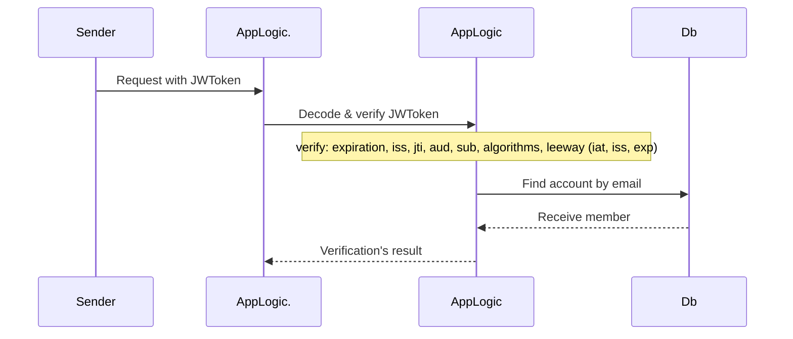

### JWT verification

```mermaid
sequenceDiagram
    participant Sender
    participant AppLogic.
    participant AppLogic
    participant Db

    Sender->>AppLogic.: Request with JWToken
    AppLogic.->>AppLogic: Decode & verify JWToken
    Note over AppLogic: verify: expiration, iss, jti, aud, sub, algorithms, leeway (iat, iss, exp)
    AppLogic->>Db: Find account by email
    Db-->>AppLogic: Receive member
    AppLogic-->>AppLogic.: Verification's result
```
