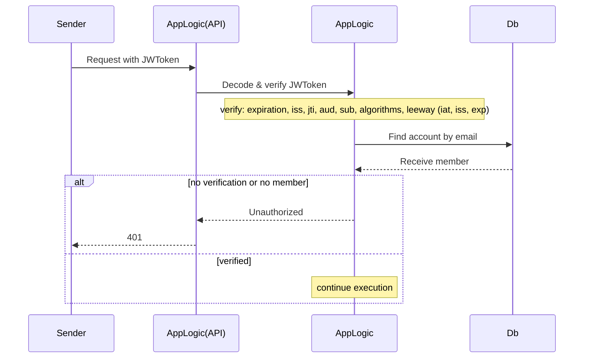

### JWT verification

```mermaid
sequenceDiagram
    participant Sender
    participant AppLogic(API)
    participant AppLogic
    participant Db

    Sender->>AppLogic(API): Request with JWToken
    AppLogic(API)->>AppLogic: Decode & verify JWToken
    Note over AppLogic: verify: expiration, iss, jti, aud, sub, algorithms, leeway (iat, iss, exp)
    AppLogic->>Db: Find account by email
    Db-->>AppLogic: Receive member
    alt no verification or no member
        AppLogic-->>AppLogic(API): Unauthorized
        AppLogic(API)-->>Sender: 401
    else verified
        Note over AppLogic: continue execution
    end
```
